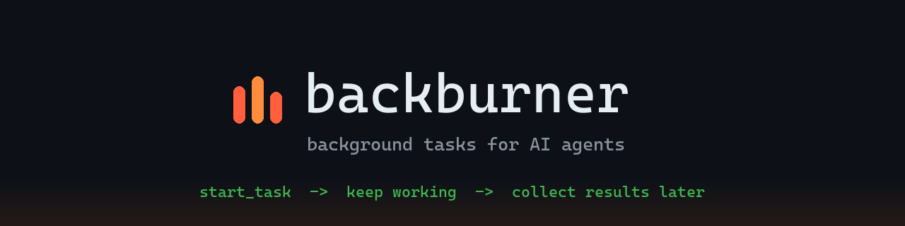
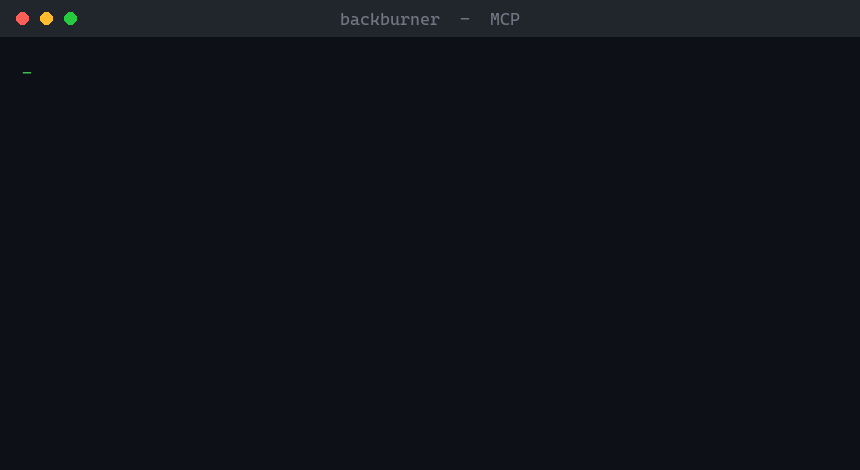

<!-- mcp-name: io.github.RohitYajee8076/backburner -->

<div align="center">



<br/>
<br/>

**Put your AI agent's slow work on the back burner. Keep cooking.**

Background tasks for AI agents that **outlive the conversation** — start a long
job, close the client, and the result is still waiting when you come back.

<b>Durable &amp; Restart-Proof&nbsp; ◦ &nbsp;Zero Infrastructure&nbsp; ◦ &nbsp;MCP Tasks (2026-07-28)&nbsp; ◦ &nbsp;Windows &amp; Unix</b>

<br/>

📦 [PyPI](https://pypi.org/project/backburner-mcp/)&nbsp; • &nbsp;🗂️ [MCP Registry](https://registry.modelcontextprotocol.io/v0/servers?search=backburner)&nbsp; • &nbsp;🐛 [Issues](https://github.com/RohitYajee8076/backburner/issues)&nbsp; • &nbsp;📄 [MIT](LICENSE)

</div>

---

## 📢 Updates

- **v1.0** — implements the official MCP **Tasks** extension
  ([SEP-2663](https://github.com/modelcontextprotocol/modelcontextprotocol/pull/2663),
  `io.modelcontextprotocol/tasks`). A Tasks-capable client can turn a
  `start_task` call into a durable task and drive it with `tasks/get`,
  `tasks/update`, and `tasks/cancel` — the standard async-job protocol — while
  the five plain tools keep working for every other client. Built against the
  **2026-07-28** spec (`mcp` 2.0).
- **v0.2.1** — output with non-ASCII characters (✓, emoji, any non-English text) no
  longer crashes tasks on Windows.
- **v0.2.0** — `exit_code` is no longer reported for cancelled/timed-out tasks
  (it was an artifact of the kill, not a real result); new animated demo below.
- **v0.1.x** — first release: 5 tools, task timeouts, command allow/deny policy.
  Listed on the official MCP Registry as `io.github.RohitYajee8076/backburner`.

---

`backburner` is an MCP server that gives any AI assistant — Claude, ChatGPT,
Gemini, GitHub Copilot, Cursor, and any other MCP client — the ability to run
long shell commands as **background tasks** — start a test suite, a build, a
scrape, a batch job — then keep working and check back for the results, instead
of sitting frozen until it finishes.



## 🔥 Why not just use my client's built-in background mode?

Because that lives **inside the conversation** — it disappears the moment the
session ends. Close the chat, restart the client, reboot the laptop, and any
in-session background work (and its output) is gone.

`backburner` keeps every task and its full output **on disk** (SQLite +
per-task log files under `~/.backburner/`), so your work outlives the session
that started it:

- **Start now, collect later — even in a different chat.** A task you launch
  today is still listed, with its result, in a brand-new session tomorrow.
- **Restart-proof.** State survives the server, the client, and the machine
  restarting. Finished tasks keep their output; a task cut off by a crash is
  honestly marked `interrupted`, never silently dropped.
- **No waiting, no blocking.** A 10-minute tool call no longer freezes the
  conversation or times out and loses the work.

See it for yourself — a real two-process proof (no mock-ups):

```bash
python docs/demo_restart.py
```

It starts a job in one process, exits, then a **separate** process — which
never saw the task id — finds the finished work waiting on disk.

Built on the MCP **Tasks** pattern, formalized in the 2026-07-28 spec release
([SEP-2663](https://github.com/modelcontextprotocol/modelcontextprotocol/pull/2663)):
`backburner` speaks it natively (`tasks/get` / `tasks/update` / `tasks/cancel`)
**and** exposes the same engine as plain tools, so it works with every client
today.

## 🧰 Tools

| Tool | What it does |
|------|--------------|
| `start_task(command, cwd?, timeout_seconds?)` | Run a shell command in the background, returns a task id immediately |
| `task_status(task_id)` | `working` / `completed` / `failed` / `cancelled` / `timed_out` / `interrupted` |
| `task_result(task_id, tail_lines?)` | Captured output — works mid-run too, so you can peek at progress |
| `cancel_task(task_id)` | Kill the task and its whole process tree |
| `list_tasks(limit?)` | Recent tasks, newest first |

## ✨ Features

- **Survives restarts** — tasks are tracked in SQLite under `~/.backburner/`;
  output is captured to per-task log files. If the server dies mid-task,
  orphaned tasks are honestly marked `interrupted`, never silently lost.
- **Real cancellation** — kills the full process tree (worker processes
  included), on Windows and Unix.
- **Peek at live progress** — `task_result` on a running task returns the
  output so far.
- **Timeouts** — pass `timeout_seconds` and a runaway task is killed and
  honestly marked `timed_out` instead of hanging forever.
- **Command policy** — restrict what the AI may run with environment
  variables (regexes, comma-separated; deny always wins):

  ```bash
  BACKBURNER_ALLOW="^pytest,^npm (test|run build)"   # only these may run
  BACKBURNER_DENY="rm -rf,shutdown,format"           # these never run
  ```
- **Zero infrastructure** — stdlib only (SQLite, subprocess, threads).
  No Redis, no Celery, no Docker.
- **Tested** — a pytest suite covers the full job lifecycle: completion,
  failure, cancellation, timeouts, crash recovery, and the command policy.

## 🚀 Install

`backburner` is a standard stdio MCP server — it works with **any MCP-compatible
client**, including:

Claude Code · Claude Desktop · OpenAI (ChatGPT desktop / Agents SDK) ·
Google Gemini (Gemini CLI) · GitHub Copilot (VS Code) · Cursor · Windsurf ·
Cline · Zed — and any other client that speaks MCP.

First install the package:

```bash
pip install backburner-mcp
```

### Claude Code

```bash
claude mcp add backburner -- python -m backburner.server
```

### Everything else (Claude Desktop, Cursor, VS Code / Copilot, Windsurf, Gemini CLI, …)

Most clients use the same standard config block — add `backburner` to your
client's MCP config (see your client's docs for where that file lives):

```json
{
  "mcpServers": {
    "backburner": {
      "command": "python",
      "args": ["-m", "backburner.server"]
    }
  }
}
```

## 🔒 Security note

`backburner` executes the shell commands the AI sends it, with your user's
permissions. That is its job — but treat it like giving your agent a
terminal. Run it only with clients whose tool-use you review/approve,
prefer permission modes that require confirmation for `start_task`, and
use `BACKBURNER_ALLOW` / `BACKBURNER_DENY` to scope what may run.

## 🗺️ Roadmap

- [x] Task timeouts and max-runtime limits
- [x] Allowlist/denylist for commands
- [x] PyPI release — `pip install backburner-mcp`
- [x] Listed on the official MCP Registry
- [x] MCP Tasks extension (spec 2026-07-28, SEP-2663) — native `tasks/get` /
      `tasks/update` / `tasks/cancel` alongside the plain tools
- [ ] Task push updates (`notifications/tasks`) — live status without polling
- [ ] Local web dashboard — watch tasks live in the browser
- [ ] Structured progress reporting (parse % / step markers from output)

## 📄 License

MIT
